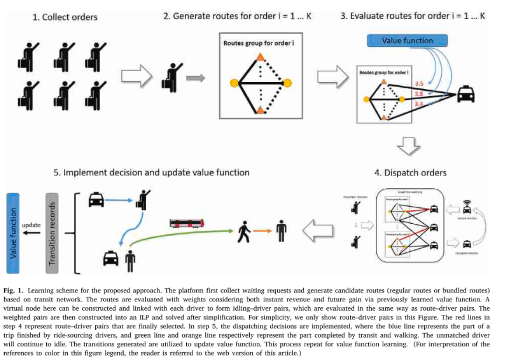
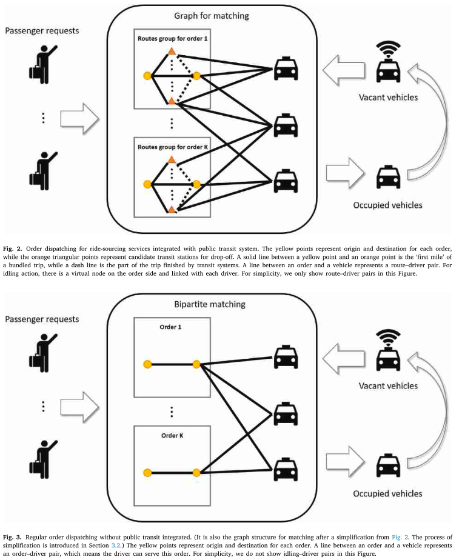

## The Q-Learning model

### The Markov-Decision-Problem
The MDP consists of a set of states *S*, a set of actions *A*, a set of rewards based on state and action *R* and state-transition probabilities *Passt*.

1. State
The state is a tuple of a grid *g* and a time interval *t*. The grid represents the current position in a zone (otherwise too many states) and the current time is part of an interval (also to manage amount of states). The set of states is finite and defined by *|S| = |G| x |T|*.

2. Action
There are two groups of action (𝐴): order serving and idling. For order serving, it can be decomposed into three steps: (1) select an order; (2) recommend to serve the order with direct ride-sourcing mode or bundled mode; (3) if bundled mode chosen, select a transportation hub (or say transit station) to drop off the passenger, leaving the rest of trip to public transit. For idling, the driver is not matched with any order and assumed to stay at the same grid till the next time interval for simplicity in the modelling of MDP.

3. Reward
Since the goal of optimization here is total revenue of the platform over the studied period, we define reward of serving an order as the order price for the vehicle part of a trip (the revenue earned by drivers, while the revenue for the part served by transit system will not be counted as reward). The reward for idling is zero.

4. State Transition
State transition probability describes the probability of transfer from the current state 𝑠 to a certain next state 𝑠′, after conducting action 𝑎. In the experiment, the state transition probability is determined by the simulator.

### Route Generation

5. Value Function Learning
Each state has a state value based on the state value function. All state values are initialized with 0. Over the time and as drivers will drive passengers the state values for each state will change based on passed orders (every day at 4am there are lots of orders at position x -> lots of money).